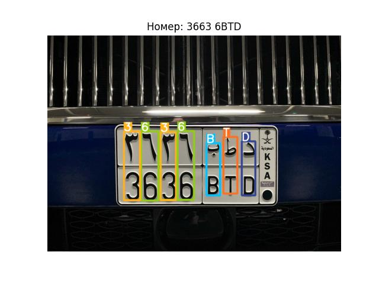

<h1 align=center>Test-CV-Rutcod</h1>
<p align=center>Распознавание номерных знаков KSA</p>

## Содержание
<ol>
  <li><a href="#задание">Задание</a></li>
  <li><a href="#структура-проекта">Структура проекта</a></li>
  <li><a href="#результаты">Результаты</a></li>
  <li><a href="#запуск-в-jupyter-notebook">Запуск в Jupyter Notebook</a></li>
  <li><a href="#запуск-ui">Запуск UI</a></li>
</ol>

## Задание
Необходимо разработать качественный детектор символов. Данные представлены в виде выборок: *train* и *test*.

## Структура проекта
Проект включает в себя:
- Data/ - папка, в которой находятся данные для обучения и тестирования модели;
- results/ - папка, в которой хранятся результаты, полученные дообученной моделью yolov8;
- runs/ - папка, в которой сохранены результаты обучения и тестирования модели;
- weights/ - папка с весами оригинальной yolov8 n и дообученной модели yolov8;
- .gitignore - файлы и папки, которые git игнорирует;
- app.py - код UI приложения;
- config.yaml - файл с конфигурацией для дообучения модели yolov8;
- notebook.ipynb - Jupyter ноутбук, в котором представлен анализ данных, работа разных моделей, обучение и тестирование модели yolov8;
- README.md - текстовый файл с описанием проекта;
- requirements.txt - файл с требуемыми версиями библиотек Python;
- yolo_fast_usage.ipynb - ноутбук для быстрого запуска дообученной модели и проверки на своих тестовых изображениях

<br>

```
Дерево проекта:
├── Data
    ├── my_examples
    ├── test
    ├── train
├── results
├── runs
    ├── detect
      ├── train
      ├── val
├── weights
    ├── best.pt
    ├── yolov8n.pt
├── .gitignore
├── app.py
├── config.yaml
├── notebook.ipynb
├── README.md
├── requirements.txt
├── yolo_fast_usage.ipynb
```

## Результаты
В результате дообучения модели yolov8n, получены следующие метрики качества на тестовых данных:
<table>
  <tr>
    <th>Метрики</th>
    <th>Значение</th>
  </tr>
  <tr>
    <td>mAP50-95</td>
    <td align="center">0.79</td>
  </tr>
  <tr>
    <td>Precision</td>
    <td align="center">0.94</td>
  </tr>
  <tr>
    <td>Recall</td>
    <td align="center">0.92</td>
  </tr>
</table>

<table>
  <tr>
      <td scope="col" colspan="2" align="center">Примеры детекции</td>
  </tr>
  <tr>
      <td></td>
      <td></td>
  </tr>
</table>


## Запуск в Jupyter Notebook
1. Клонировать репозиторий:
```sh
git clone https://github.com/makea2018/Test-CV-Rutcod.git
```
2. Перейти в папку проекта и установить все необходимые библиотеки:
```sh
pip install -r requirements.txt
```
3. Для быстрого запуска и тестирования модели открыть ноутбук [yolo_fast_usage.ipynb](./yolo_fast_usage.ipynb)

## Важная информация
1. Все изображения для проверки модели должны находиться в папке [Data/my_examples](./Data/my_examples/)
2. Для воспроизведения кода работы моделей 'Tesseract' и 'EasyOCR' - раcкомментировать версии библиотек в файле [requirements.txt](requirements.txt), а также установить ядро Tesseract по [ссылке](https://digi.bib.uni-mannheim.de/tesseract/tesseract-ocr-w64-setup-5.3.3.20231005.exe) - установить в папку ../Tesseract-OCR

## Запуск UI
Возможно запустить проект в браузере и использовать модель через 'UI' - графический интерфейс пользователя. Интерфейс приложения написан на фреймворке 'Flet'. Версия библиотеки 'Flet' указана в файле [requirements.txt](./requirements.txt)

**Инструкция:**
1. Клонировать репозиторий:
```sh
git clone https://github.com/makea2018/Test-CV-Rutcod.git
```
2. Перейти в папку проекта и установить все необходимые библиотеки:
```sh
pip install -r requirements.txt
```
3. Запустить файл app.py командой:
```sh
python app.py
```

**Пример работы** приложения с UI представлен ниже:  
  
